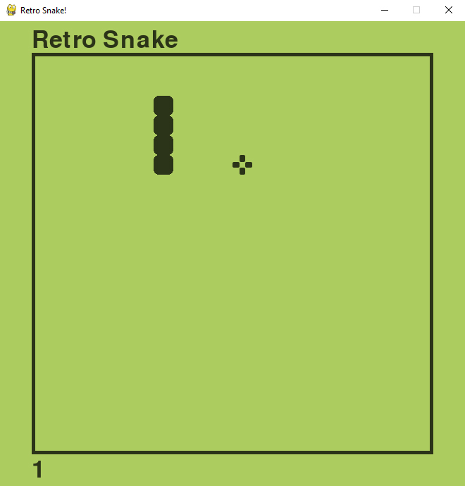

# Source Start Python Retro Snake Game

Welcome to the Source Start Python Retro Snake Game repository! We're excited to have you as a potential contributor to our classic snake game built with Python and Pygame.



## Table of Contents

- [Introduction](#introduction)
- [Getting Started](#getting-started)
- [Project Structure](#project-structure)
- [How to Contribute](#how-to-contribute)
- [Features to Implement](#features-to-implement)

## Introduction

This repository contains the source code for a retro-style Snake game built with Python and Pygame. The game features classic Snake gameplay where players control a snake to eat food, grow longer, and avoid collisions with walls and the snake's own body. As part of "Source Start," an open source event organized by CSI SPIT, we invite developers, game enthusiasts, and Python learners to contribute to this project by adding new features, improving gameplay mechanics, enhancing graphics, or optimizing the code.

## Getting Started

To get started with the project, follow these steps:

1. **Fork the Repository:** Click the "Fork" button on the top right corner of this repository to create a copy in your GitHub account.

2. **Clone Your Fork:** Clone your fork of the repository to your local machine using `git clone`.

   ```bash
   git clone https://github.com/your-username/Python-Retro-Snake-Game-Pygame.git
   ```

3. **Install Dependencies:** Navigate to the project directory and install the required dependencies.

   ```bash
   cd Python-Retro-Snake-Game-Pygame
   pip install pygame
   ```

4. **Run the Game:** Start the game to see it in action.

   ```bash
   python snake.py
   ```

5. **Play the Game:** Use arrow keys to control the snake. Try to eat the food (red apple) without hitting the walls or the snake's body!

## Project Structure

The project is structured as follows:

- `snake.py`: Main game file containing all game logic, classes, and game loop.
- `Graphics/`: Directory containing game graphics and sprites.
  - `food.png`: Sprite for the food item.
- `Sounds/`: Directory containing game sound effects.
  - `eat.mp3`: Sound played when snake eats food.
  - `wall.mp3`: Sound played when snake hits wall or itself.
- `preview.jpg`: Preview image of the game.
- `README.md`: This README file.

## How to Contribute

We welcome and encourage contributions from the community to make this project better. To contribute:

1. **Create a New Branch:** Create a new branch for your contribution.

   ```bash
   git checkout -b feature/my-contribution
   ```

2. **Make Changes:** Work on your contribution, make changes, and add new features.

3. **Test Your Changes:** Test your changes thoroughly to ensure they work as expected and don't break existing functionality.

4. **Commit Changes:** Commit your changes with a descriptive commit message.

   ```bash
   git commit -m "Add feature: Description of your contribution"
   ```

5. **Push Changes:** Push your changes to your fork on GitHub.

   ```bash
   git push origin feature/my-contribution
   ```

6. **Create a Pull Request:** Create a pull request (PR) from your fork to this repository. Describe your changes and the purpose of the PR.

We will review your PR and merge it if it meets the project's standards.

## Features to Implement

Here are some ideas for contributions:

- **Difficulty Levels:** Add easy, medium, and hard difficulty modes with different snake speeds
- **High Score System:** Implement a persistent high score system that saves to a file
- **Power-ups:** Add special food items with different effects (speed boost, score multiplier, etc.)
- **Better Graphics:** Improve the visual design with better sprites and animations
- **Menu System:** Add a main menu, pause functionality, and game over screen
- **Sound Effects:** Add more sound effects and background music
- **Multiplayer Mode:** Implement a two-player mode
- **Level System:** Add different levels with obstacles or varying board sizes
- **Mobile Controls:** Add touch/click controls for mobile devices
- **Configuration File:** Add a settings file to customize game parameters


---

Thank you for participating in "Source Start" organized by CSI SPIT! We look forward to your contributions to help make this Snake game more engaging and feature-rich. Whether you're a beginner or experienced developer, there's something for everyone to contribute. Happy coding! 🐍🎮
